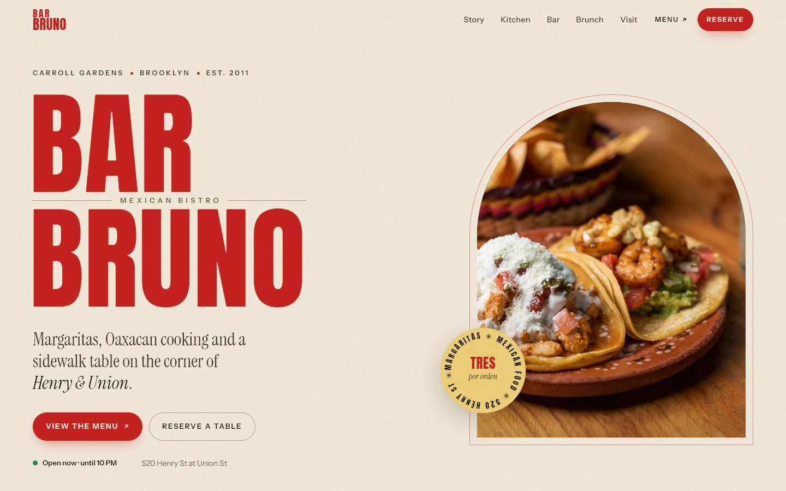
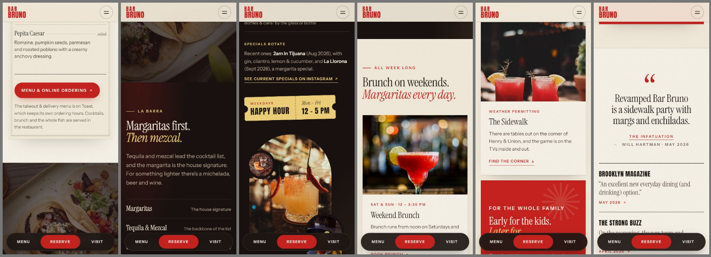

# Bar Bruno — Website

A one-page marketing site for **Bar Bruno**, a Mexican bistro at **520 Henry St, Brooklyn** (Carroll Gardens, a short walk from Cobble Hill). It's plain HTML, CSS and JavaScript, with no build step and no dependencies.



<details>
<summary>Mobile screens</summary>



</details>

> **Unofficial concept site.** Bar Bruno did not create this site, and it isn't affiliated with the restaurant. The photos are illustrative stock images (see [Credits](#credits)).

## Features

- **Link to the restaurant's live menu** on Toast in the nav, hero, menu card, mobile drawer, mobile quick bar and footer, plus Resy reservations throughout
- **Live open/closed badge** computed in New York time (it also shows happy hour and brunch), with today's row highlighted in the hours table
- **Menu highlights card** styled like a printed carta, with no prices, so it never goes stale
- **Responsive** from 320px phones to wide desktops, including a mobile drawer and a floating Menu / Reserve / Visit bar
- **Accessible:**
  - semantic landmarks and a skip link
  - focus kept inside the open drawer
  - WCAG AA text contrast
  - `lang="es"` on Spanish phrases
  - a pause button for motion, plus `prefers-reduced-motion` support
- **Resilient:** content stays visible with JavaScript disabled or if `main.js` fails to load, and there's a print stylesheet
- **SEO:** `Restaurant` JSON-LD (address, geo, hours, menu, reservations), meta description and Open Graph tags

## Project structure

```
bar-bruno/
├── index.html            # All content and markup, plus JSON-LD
├── styles.css            # Design tokens, layout, responsive and print rules
├── main.js               # Scroll reveals, nav/drawer, open-now status, motion toggle
├── favicon.svg           # SVG favicon
├── favicon-32.png        # PNG favicon fallback
├── apple-touch-icon.png  # iOS home-screen icon
└── docs/                 # README screenshots
```

## Running locally

Any static file server works. For example:

```bash
npx serve .
```

```bash
python -m http.server 8000
```

You can also open `index.html` directly in a browser. The embedded map and web fonts need an internet connection.

## Deploying

Upload the folder to any static host, such as GitHub Pages, Netlify, Vercel or Cloudflare Pages. No build step is needed.

Before going live:
1. Replace the stock photos with the restaurant's own photography.
2. In `<head>`, add `<link rel="canonical">`, `og:url` and an `og:image` (a licensed 1200×630 photo). A comment marks the spot.
3. Confirm the hours, phone number and menu link with the restaurant (details below).

## Updating content

| What | Where |
|---|---|
| Opening, happy hour and brunch hours | The hours table in `index.html` (`#visit`), the footer, the JSON-LD `openingHoursSpecification` **and** the constants at the top of the status section in `main.js` (`OPEN`, `CLOSE`, `HH_END`, `BRUNCH_END`) |
| Menu / reservation links | Search `index.html` for `order.toasttab.com` and `resy.com` |
| Menu highlights | The `.menu-card` block in `index.html` |
| Colors & fonts | CSS custom properties in `:root` at the top of `styles.css` |

## Content sources

The copy was researched and fact-checked against these public sources, checked in September 2026:
- The restaurant's Instagram and TikTok (**@barbrunobk**), its Resy listing, its Toast ordering page and its Google Business Profile
- Press: [The Infatuation](https://www.theinfatuation.com/new-york/reviews/bar-bruno) (May 2026), [Brooklyn Magazine](https://www.bkmag.com/2026/05/04/bar-bruno-carroll-gardens-opens-greenpoint-fish-and-lobster-team/) (May 2026) and [The Strong Buzz](https://andreastrong.substack.com/p/three-brooklyn-openings) (Apr 2026)

Notes:
- **Menu:** the linked Toast page is the takeout & delivery menu. Drinks and brunch aren't published online.
- **Phone number:** it comes from the Google and Grubhub listings, not from the owners' own channels.
- **No official site:** the restaurant has none. The old domain `barbrunonyc.com` now redirects to an unrelated business, so the site doesn't link it.

## Credits

- **Photos:** [Unsplash](https://unsplash.com) (Unsplash License), used as illustrative placeholders. They don't show Bar Bruno's food, room or street.
  - Snappr
  - Nahima Aparicio
  - Zoshua Colah
  - We The Creators
  - Himal Rana
  - César Cabrera
  - Hector Reyes
  - Tai's Captures
  - Santeri
- **Fonts:** [Anton](https://fonts.google.com/specimen/Anton), [Instrument Serif](https://fonts.google.com/specimen/Instrument+Serif) and [Instrument Sans](https://fonts.google.com/specimen/Instrument+Sans) via Google Fonts (SIL Open Font License)
- **Map:** Google Maps embed
- The Bar Bruno name belongs to the restaurant.
